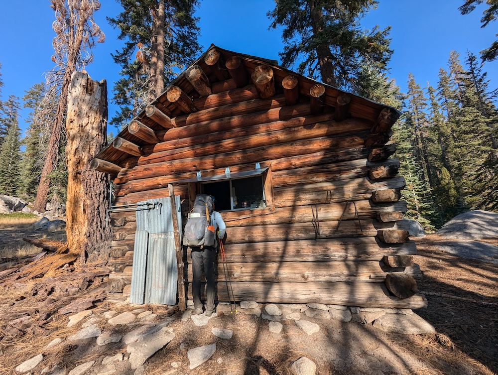
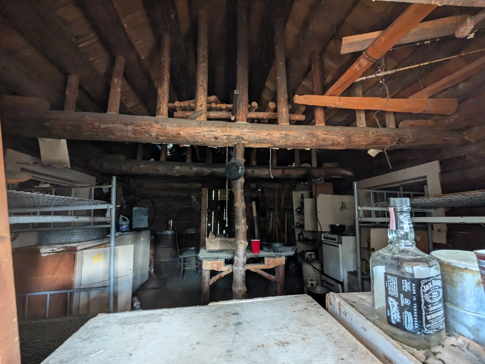
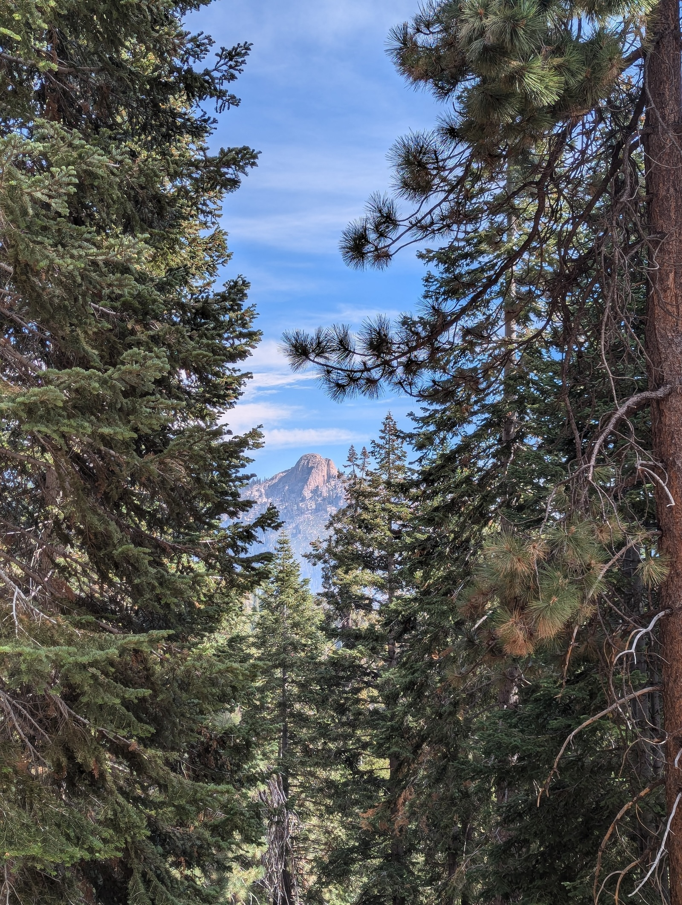
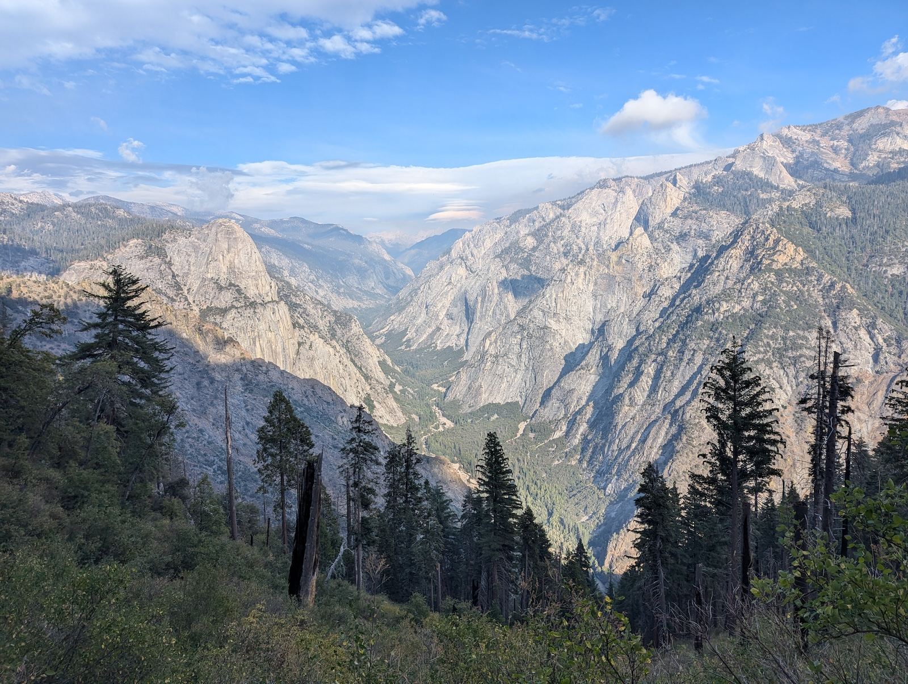
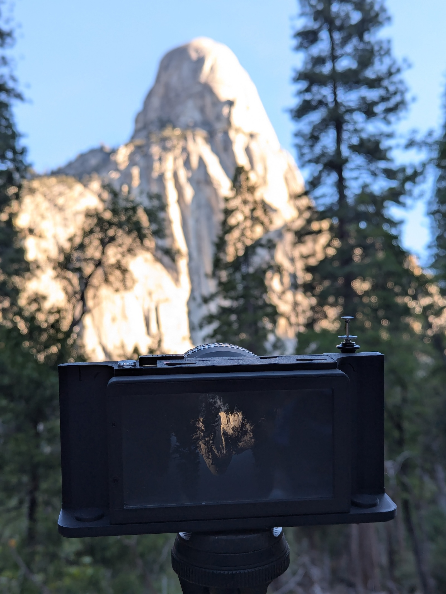
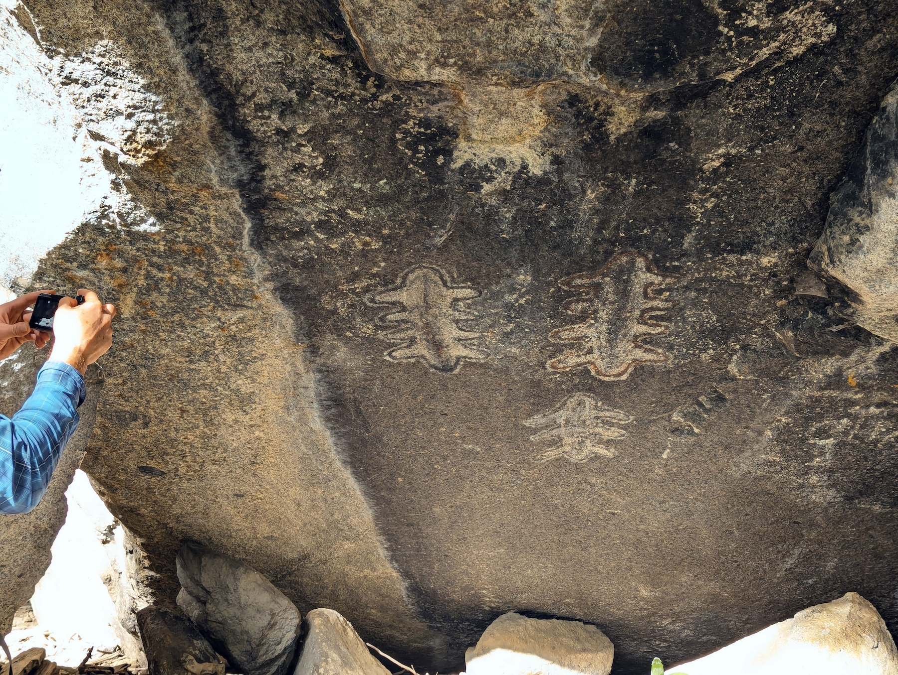
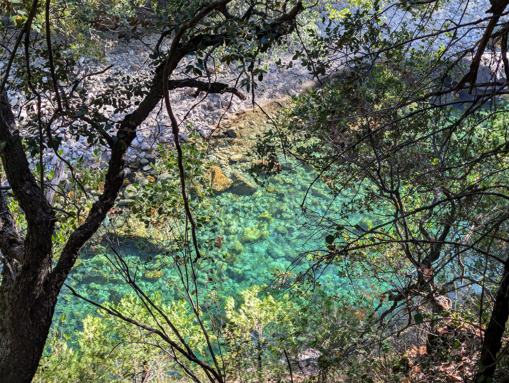
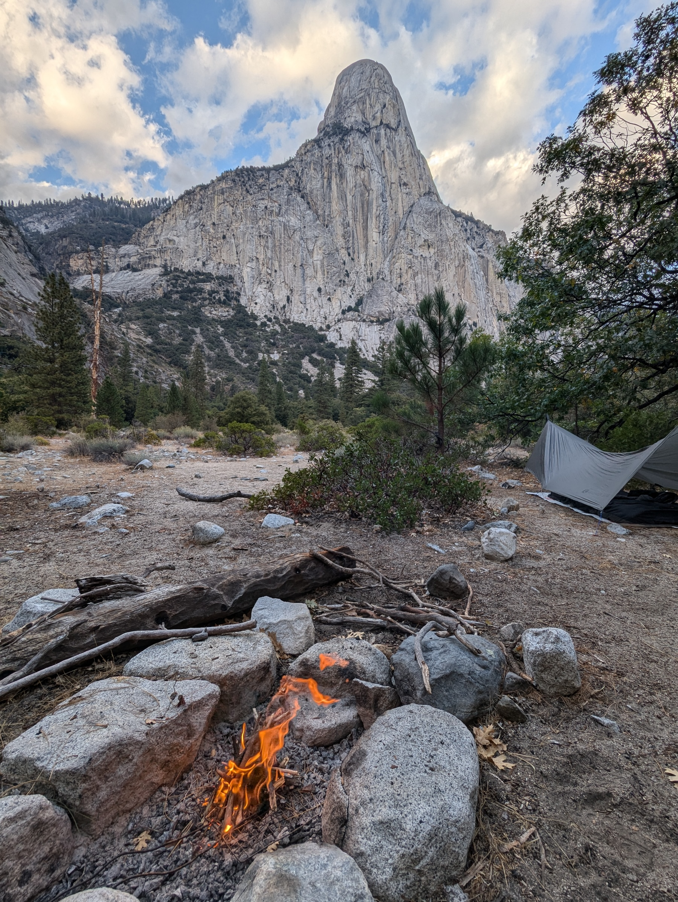
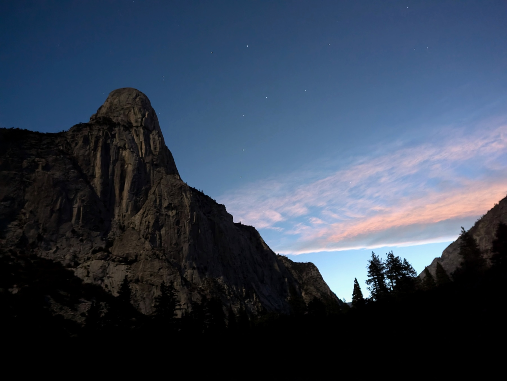
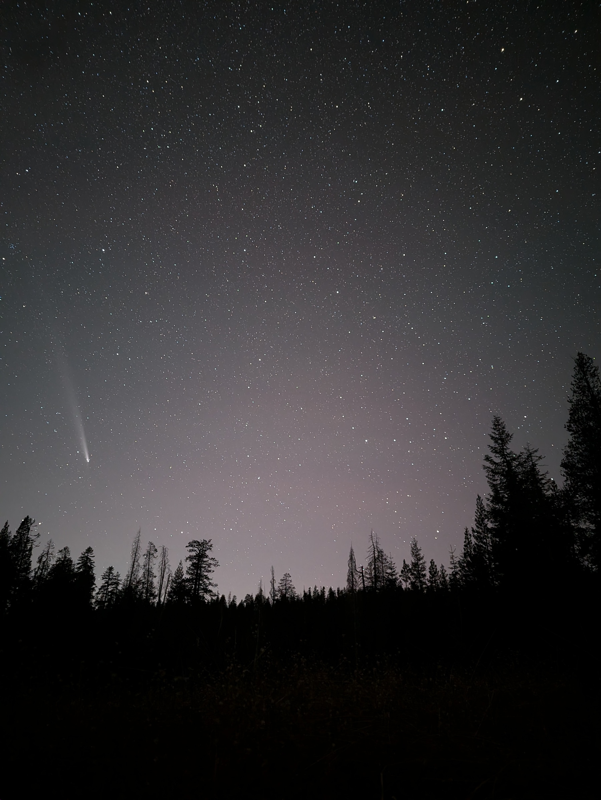

HST has been super helpful to me on my first trips as a new backpacker. Big thanks to the admins, moderators, and contributors. This is my first time posting. Here's a quick report of a recent trip to Tehipite Valley.

I drove up from Oakland and met @cboone at a deserted Rancheria Trailhead last Tuesday mid-afternoon. We started around 4pm, and hiked in to just beyond the turnoff to Spanish Lake. Nice view of Crown Rock from the meadow around there.

Wednesday we got a late start. Poked around Crown Valley Station a little. The steel plate on the back window is loose, allowing a view inside...seemingly abandoned, unremarkable other than a big empty bottle of whiskey.

Strolled around Johnson's Cow Camp ("Absolutely no camping"). Encountered many downed trees in the forest on the approach to the big descent, so we lost the trail a few times. Nice views of Kettle Dome peaking through the trees.

We made an ill-advised attempt to cross the meadow labeled "Hay Meadow" on the USGS topo, then bailed when it got swampy in the middle and trudged back up to find the trail higher up. We arrived at the precipice pretty late in the day; longer walk to get there than we expected. Breathtaking views of the dome and valley.

With a little rain in the forecast, we briefly considered waiting until Thursday to descend, but decided to go for it. Pretty tough going; it is indeed quite steep, and more downed trees to climb over. Then at the bottom there's another mile or so to the valley proper, including a patch of prickly blackberry. So we were pretty exhausted by the time we made it to a decent campsite, just a few hundred yards shy of a much better one.

Thursday we moved along into the big open part of the valley below the dome and re-set camp at a better site by the river. Dome-marveling — and photographing — continued.

Still pretty tired, we took a slow walk upstream in the afternoon and found the Painted Rock right around where the USGS maps said it would be. It's worth taking some unhurried time to behold the petroglyphs.

Were they the work of just one artist or multiple? What do they represent, if anything? A human family? Or maybe just a casual doodle...but I doubt it; they strike me as being pretty artful and deliberate, with both subtractive (scraping away rock varnish) and additive (applying pigment) processes, and a lot of interesting detail. The October afternoon we were there, the sun almost reached them. There might be a few winter days when the sun is lower in the sky when they do get some direct sunlight. That would be cool to see & photograph. The boulder is climbable from the back for a different and interesting prospect over the river.

Friday, separate excursions. Chris went farther upstream, I went downstream, past one tough section of steep hillside, to some spectacular river cascades & pools...and almost but not quite to Little Tehipite Valley.

On the way back I discovered an easier way through the first section; this late in the year when it's dry, the creek right at the bottom of the descent makes a nice staircase up and down to the river. Back at the campsite, the dome, like the petroglyphs, rewarded lengthy gazing.

Different guises as the light changes, and a particularly gorgeous prospect in the moonlight.

Saturday: we set an alarm to make an early start up and out of the valley. A little more than two hours to the top, made harder by fighting upstream against the foliage. Then a once-again-longer-than-expected walk back through the downed trees & inconsistent trail, losing and re-finding it a few times. Our legs were jelly by the time we got back to the Rocky Creek crossing, so we camped in the open meadow there. Nice spot, big open view of the sky, so we caught a glimpse of the Comet C/2023 A3 (Tsuchinshan–ATLAS) before the moon rose.

Sunday we hiked back to the TH on tired legs. Found the "Grave" marked on the USGS topo just east of Crown Valley Station. "Ike Smit, 1914." Fake, evidently! According to one report, anyway (www.douglasvanbossuyt.com/tag/johnsons-cow-camp) ¯\_(ツ)_/¯. On the way out we saw the only other humans we'd come across since Tuesday, a pair of hunters hiking in to Crown Valley. They were putting up bright orange plastic ribbons at regular intervals along a very unambiguous section of trail, unclear to us why. Hopefully they removed all the blazing when they left.

Overall assessment: the valley really is difficult to reach! The steep part itself was hard but doable (although could easily have been much less so, given an unlucky tree-fall or dirt-slide.), but made more difficult by tired legs from the long hike to and from. Not surprising that it's so infrequently visited. Of course that's part of the charm, so for those with the time and fortitude, easily recommendable; I'm very glad to have seen it. Thanks, @cboone, for joining me on this marvelous trip!
