# Discussing MMR vaccines with an LLM after a brief content review
increases vaccination intent among hesitant parents
Scott J. Forman
2025-09-15

<link  href="analysis_files/libs/quarto-diagram/mermaid.css" rel="stylesheet" />

## Abstract

We conducted a preregistered two‑arm online RCT (N = 180 MMR hesitant
U.S. parents of young children) comparing a timer‑gated four‑panel MMR
content carousel followed by an LLM‑guided conversation against a
structure-matched, non‑vaccine-related active control (car seat safety).
An ANCOVA on post‑intent controlling for baseline intention estimates an
adjusted arm effect of **β̂ ≈ 1.03** points (95% CI **0.72–1.34**) on a
1–7 vaccination intention scale. A post‑intervention delayed follow‑up
on a separate sample (N = 66) shows a consistent effect size of **β̂ ≈
1.09** (95% CI **0.52, 1.66**). Conclusion: a brief intervention
combining persuasive content with an LLM conversation significantly
increases MMR intention relative to control, with signs of durability
over a period of several days.

## Preregistration

- OSF preregistration: [Using Conversational AI to Support Parental MMR
  Decision‑Making: An Active‑Control Randomized
  Trial](https://osf.io/qx46h)
- Deviations: (i) An initial outcome‑page failure prevented immediate
  post‑intent collection for a subset; those participants were later
  contacted in a rescue follow‑up. Confirmatory inference uses only the
  clean re‑run per preregistration; the rescue durability analysis is
  exploratory. (ii) Compensation increased across batches to maintain
  enrollment (\$2.50 → \$3.50 → \$4.50) without changing the protocol or
  analysis plan.
- Confirmatory set and exclusions: in preregistration, hard exclusions
  for obvious bots or exposure failures were planned. In practice no
  participant could be unambiguously classified as such, so the
  confirmatory set includes all randomized participants who completed
  the study. We report a sensitivity excluding two borderline cases;
  results are unchanged.

## Methods

- Recruitment: U.S.-resident parents of at least one child born in 2019
  or later, who indicated less than complete confidence in vaccine
  safety, and who had not participated in one of our previous studies,
  were recruited via [Prolific](https://www.prolific.com/).
- Flow: After consenting, participants were shown a mock‑appointment
  page with two buttons: “I have questions or concerns about MMR” and
  “No concerns about the MMR vaccine.” Participants who clicked “No
  concerns about the MMR vaccine” were screened out and awarded a small
  payment. Participants who clicked “I have questions or concerns about
  MMR” were asked to imagine an upcoming appointment with a pediatric
  medical provider, and indicate on a scale of 1-7 the likelihood that
  they would have their child receive a dose of the MMR vaccine at that
  visit. Those at the ceiling (7) exited and were granted a small
  payment. Those with baseline ≤ 6 were randomized 1:1 to Experimental
  or Control, and completed a short pre-intervention demographic survey.
  All randomized participants saw the matched carousel and interactive
  chat segment, then answered the vaccination intent question a second
  time.
- Structure: Both study arms used the same interface and engagement
  rules. Participants first saw a brief, scrollable information
  carousel, followed by an interactive conversation segment. The only
  difference between arms was the content topic: MMR vaccine
  (Experimental) versus car‑seat safety (Active Control).
- Outcome: Post‑intervention MMR intention (1–7). The primary analysis
  adjusted for baseline intention.
- Primary model: ANCOVA `post_intent ~ arm_coded + pre_intent` with HC3
  robust SEs on participants with baseline head‑room (≤ 6) who met
  preregistered engagement rules. We retained all randomized
  participants; two cases appeared borderline low‑quality and were
  excluded in a sensitivity check, which did not materially change
  results.
- A separate exploratory “durability” analysis used delayed post‑intent
  from the “rescue” dataset.
- Batches: Recruitment proceeded in three batches with rising
  compensation to maintain enrollment when it slowed: Batch 2B at
  \$2.50, Batch 2B2 at \$3.50, and Batch 2B3 at \$4.50. Each relaunch
  followed the same protocol and analysis plan.

## Data Import

Here we load all data sources used in the analysis.

### Main RCT‑2 Analysis Views

| batch | file |
|:---|:---|
| 2B | /Users/scott/Projects/verum-analysis/experiments/45ff14/data_freezes/experiment_analysis_view_exp-45ff14_20250910-153854.csv |
| 2B2 | /Users/scott/Projects/verum-analysis/experiments/5bb2fd/data_freezes/experiment_analysis_view_exp-5bb2fd_20250910-153904.csv |
| 2B3 | /Users/scott/Projects/verum-analysis/experiments/8bb589/data_freezes/experiment_analysis_view_exp-8bb589_20250910-095801.csv |

Selected analysis‑view files (Main RCT‑2)

| N_rows | N_with_pre | N_with_post |
|-------:|-----------:|------------:|
|    180 |        180 |         180 |

Main freezes: coverage of pre/post intention

These denormalized analysis views are the batch‑level source used for
the confirmatory models (one row per randomized participant, with
assigned condition, pre/post intention, engagement metrics, and batch
labels).

### Durability (Rescue) Files

| file_role | file |
|:---|:---|
| rescue_analysis_view | /Users/scott/Projects/verum-analysis/experiments/ab8086/data_freezes/experiment_analysis_view_exp-ab8086_nopost.csv |
| rescue_prolific_csv | /Users/scott/Projects/verum-analysis/experiments/ab8086/data_freezes/prolific_export_68a63717859761977be4e572.csv |

Durability input files

| N_rows | N_with_pre | N_with_post_rescue |
|-------:|-----------:|-------------------:|
|     90 |         90 |                 66 |

Rescue set: coverage of pre and delayed post‑intent

| arm_fct   |   N | Responded | Rate  |
|:----------|----:|----------:|:------|
| Control   |  42 |        34 | 81.0% |
| Treatment |  48 |        32 | 66.7% |

Rescue follow-up response by assigned arm

The rescue analysis_view contains baseline and process fields from the
affected run; the Prolific export holds delayed post‑intent collected
later. We link them by hashed Prolific IDs and compute the delay in days
between intervention completion and the post-intervention intent data
collection.

### Prolific Exports

| batch | file |
|:---|:---|
| 2B | /Users/scott/Projects/verum-analysis/experiments/45ff14/data_freezes/prolific_export_68a76e72f871f463046d251c.csv |
| 2B2 | /Users/scott/Projects/verum-analysis/experiments/5bb2fd/data_freezes/prolific_export_68b21405c16a8fdf41af130d.csv |
| 2B3 | /Users/scott/Projects/verum-analysis/experiments/8bb589/data_freezes/prolific_export_68b8b8dffb63864bf9db9ea6.csv |

Resolved Prolific exports (latest by dir)

| status       | 2B           | 2B2          | 2B3          | Total |
|:-------------|:-------------|:-------------|:-------------|------:|
| RETURNED     | 89 (30.1%)   | 41 (20.8%)   | 32 (19.9%)   |   162 |
| SCREENED OUT | 122 (41.2%)  | 88 (44.7%)   | 77 (47.8%)   |   287 |
| REJECTED     | 2 (0.7%)     | 5 (2.5%)     | 4 (2.5%)     |    11 |
| APPROVED     | 76 (25.7%)   | 57 (28.9%)   | 45 (28.0%)   |   178 |
| NA           | 7 (2.4%)     | 6 (3.0%)     | 3 (1.9%)     |    16 |
| Total        | 296 (100.0%) | 197 (100.0%) | 161 (100.0%) |   654 |

Prolific statuses by batch with totals (N and % of batch total)

These Prolific exports summarize recruitment statuses by batch (e.g.,
APPROVED, RETURNED). They are used for flow and recruitment descriptives
only, not for outcome modeling.

### Exit Paths

| batch | file |
|:---|:---|
| 2B | /Users/scott/Projects/verum-analysis/experiments/45ff14/data_freezes/exit_paths.csv |
| 2B2 | /Users/scott/Projects/verum-analysis/experiments/5bb2fd/data_freezes/exit_paths.csv |
| 2B3 | /Users/scott/Projects/verum-analysis/experiments/8bb589/data_freezes/exit_paths.csv |

Resolved exit_paths.csv per batch

| path     | 2B           | 2B2          | 2B3          | Total |
|:---------|:-------------|:-------------|:-------------|------:|
| confirm  | 123 (58.6%)  | 93 (58.5%)   | 68 (53.1%)   |   284 |
| ceiling  | 10 (4.8%)    | 8 (5.0%)     | 15 (11.7%)   |    33 |
| complete | 77 (36.7%)   | 58 (36.5%)   | 45 (35.2%)   |   180 |
| Total    | 210 (100.0%) | 159 (100.0%) | 128 (100.0%) |   497 |

Exit pathways by batch (DB): N and % of batch total (confirm → ceiling →
complete)

Exit paths provide the database source‑of‑truth for participant flow
through the mock‑appointment step and pre-intervention intent survey
(“confirm” \[no concerns about MMR\], “ceiling” \[pre-intervention
intent = 7\], “complete”). We use these counts for the reach metric and
in the CONSORT‑style flow diagram.

## Sample Composition

We summarize randomized participants from the analysis view, as counts
and percentages within each batch.

| arm_fct   | 2B          | 2B2         | 2B3         | Total |
|:----------|:------------|:------------|:------------|------:|
| Control   | 38 (49.4%)  | 29 (50.0%)  | 22 (48.9%)  |    89 |
| Treatment | 39 (50.6%)  | 29 (50.0%)  | 23 (51.1%)  |    91 |
| Total     | 77 (100.0%) | 58 (100.0%) | 45 (100.0%) |   180 |

Randomized sample by arm and batch (N and % of batch total)

## Demographics

We summarize basic demographics using fields captured in the pre‑survey
JSON (age, gender, political ideology).

The sample skews female (68.9%). Ideology leans conservative (51.7%).
Ages cluster in 25-34 (51.1%) and 35-44 (34.4%).

### Age

| Level |   N | Percent |
|:------|----:|:--------|
| 25-34 |  92 | 51.1%   |
| 35-44 |  62 | 34.4%   |
| 45-54 |  14 | 7.8%    |
| 18-24 |   8 | 4.4%    |
| 55-64 |   4 | 2.2%    |

Age distribution (counts and %)

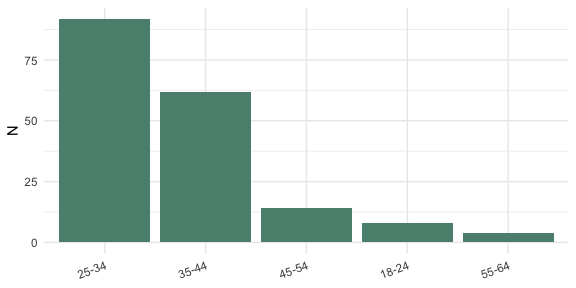

### Gender

| Level      |   N | Percent |
|:-----------|----:|:--------|
| female     | 124 | 68.9%   |
| male       |  55 | 30.6%   |
| prefer-not |   1 | 0.6%    |

Gender distribution (counts and %)

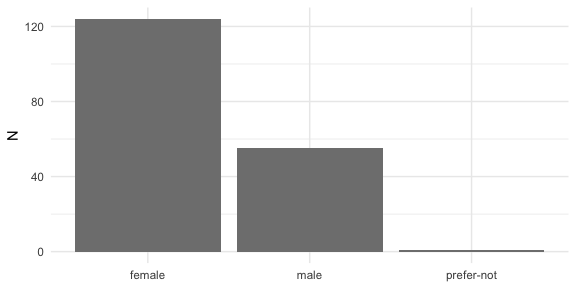

### Political ideology

| Level        |   N | Percent |
|:-------------|----:|:--------|
| conservative |  93 | 51.7%   |
| moderate     |  52 | 28.9%   |
| liberal      |  32 | 17.8%   |
| prefer-not   |   3 | 1.7%    |

Political ideology distribution (counts and %)

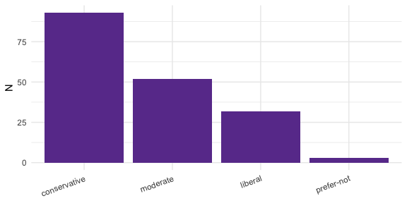

## Overview of Participant Flow

<pre class="mermaid mermaid-js">flowchart TD
A[Started study: 654] --> A0[Abandoned: 157]
A --> B[Consented: 497]
B --> S[Screened out: 317]
S --> C[No concerns about the MMR vaccine: 284]
S --> D[Ceiling: 33]
B --> E[Randomized: 180]
E --> A1[Allocated to Control: 89]
E --> A2[Allocated to Treatment: 91]</pre>

<figure class=''>

<pre class="mermaid mermaid-js">flowchart LR
init([.]) --&gt; ready([.])
</pre>

</figure>

Among those who reached the mock‑appointment screen (N = 497), 42.9%
(95% CI \[38.5, 47.3\]%) clicked “I have questions or concerns about
MMR” (N = 213) and 57.1% (95% CI \[52.7, 61.5\]%) clicked “No concerns
about the MMR vaccine” (N = 284). Within the questions/concerns branch,
15.5% (95% CI \[10.9, 21.1\]%) selected a baseline of 7 (N = 33) and
84.5% (95% CI \[78.9, 89.1\]%) had baseline ≤ 6 and proceeded to the
intervention (N = 180). Overall, reach to the intervention was 36.2%
(95% CI \[32.0, 40.6\]%) of those at the mock‑appointment step.

## Batch Comparability

We test arm balance across batches and baseline comparability. Arms are
balanced (p = 0.994); baseline intention is similar across batches
(ANOVA p = 0.321); the estimated arm effect is stable across batches
(Arm×Batch interaction p-values ≥ 0.943).

| batch_fct | Control | Treatment |
|:----------|--------:|----------:|
| 2B        |      38 |        39 |
| 2B2       |      29 |        29 |
| 2B3       |      22 |        23 |

Arm counts by batch

    Arm~Batch Chi-squared p-value: 0.994

| batch_fct |   N | mean_pre | sd_pre |
|:----------|----:|---------:|-------:|
| 2B        |  77 |     3.91 |   1.89 |
| 2B2       |  58 |     3.43 |   1.89 |
| 2B3       |  45 |     3.82 |   1.83 |

Baseline intention by batch

    ANOVA for baseline intention across batches:

                 Df Sum Sq Mean Sq F value Pr(>F)
    batch_fct     2    8.0   4.017   1.145  0.321
    Residuals   177  621.2   3.509               

    ANCOVA with Arm × Batch interaction (HC3):

    t test of coefficients:

                            Estimate Std. Error t value  Pr(>|t|)    
    (Intercept)             0.044968   0.186083  0.2417 0.8093330    
    pre_intent              1.008784   0.045729 22.0601 < 2.2e-16 ***
    arm_coded               0.971629   0.258973  3.7519 0.0002393 ***
    batch_fct2B2           -0.040774   0.217222 -0.1877 0.8513262    
    batch_fct2B3           -0.122763   0.106576 -1.1519 0.2509601    
    arm_coded:batch_fct2B2  0.028674   0.402701  0.0712 0.9433185    
    arm_coded:batch_fct2B3  0.201847   0.347880  0.5802 0.5625206    
    ---
    Signif. codes:  0 '***' 0.001 '**' 0.01 '*' 0.05 '.' 0.1 ' ' 1

## Confirmatory Analysis

### H1 – Arm effect on post‑intervention intention

We estimate the adjusted arm difference using a simple ANCOVA on
participants with baseline head‑room (≤ 6) who met preregistered
engagement rules, and find that the treatment increased MMR‑intention by
about a full point on the 1–7 scale (adjusted for baseline). All
participants are retained; two borderline low‑quality cases do not
affect results.

post_intent = β0 + β1·arm_coded + β2·pre_intent + ε

- arm_coded = 1 for Treatment (MMR chat), 0 for Control.
- We report HC3 robust SEs, a 95% CI for β1, and partial η² as an
  effect‑size.

<!-- -->

    Confirmatory sample size: 180

    HC3 robust coefficients (ANCOVA):

    t test of coefficients:

                  Estimate Std. Error t value  Pr(>|t|)    
    (Intercept) -0.0029969  0.1612087 -0.0186    0.9852    
    arm_coded    1.0312818  0.1584499  6.5086 7.547e-10 ***
    pre_intent   1.0099595  0.0428955 23.5446 < 2.2e-16 ***
    ---
    Signif. codes:  0 '***' 0.001 '**' 0.01 '*' 0.05 '.' 0.1 ' ' 1

| term      | estimate | std.error |  conf.low | conf.high |
|:----------|---------:|----------:|----------:|----------:|
| arm_coded | 1.031282 | 0.1584499 | 0.7185877 |  1.343976 |

Arm effect (Treatment vs Control) with HC3 SEs and 95% CI

    Partial Eta^2 (ANCOVA):
    # Effect Size for ANOVA (Type I)

    Parameter  | Eta2 (partial) |       95% CI
    ------------------------------------------
    arm_coded  |           0.23 | [0.14, 1.00]
    pre_intent |           0.77 | [0.72, 1.00]

    - One-sided CIs: upper bound fixed at [1.00].

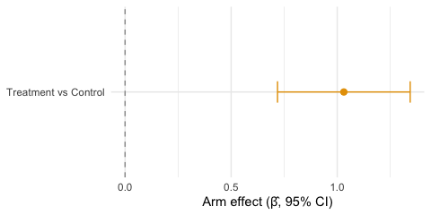

| metric                             | value |
|:-----------------------------------|------:|
| Cohen’s d (ANCOVA, residual SD)    | 0.984 |
| Hedges’ g (small-sample corrected) | 0.980 |

Standardized arm effect from ANCOVA

Method: unstandardized arm coefficient divided by model residual SD
(ANCOVA), with Hedges’ correction J. This standardizes the adjusted mean
difference.

### Residual Diagnostics

We summarize how far model predictions are from the observed post‑intent
(after accounting for baseline). Smaller, centered residuals indicate
the model is fitting sensibly.

| Metric  | Value |
|:--------|------:|
| Min     | -3.09 |
| 1st Qu. | -0.09 |
| Median  | -0.05 |
| Mean    |  0.00 |
| 3rd Qu. | -0.01 |
| Max     |  4.96 |
| SD      |  1.04 |

Residual summary for primary ANCOVA

### Sensitivity: Rank-Inverse-Normal (RIN) transform

As a robustness check, we apply a RIN transform to both intention
variables and re-estimate the model.

| term      | estimate | std.error | conf.low | conf.high |
|:----------|---------:|----------:|---------:|----------:|
| arm_coded |    0.473 |     0.073 |    0.328 |     0.618 |

RIN-transform sensitivity: arm effect (HC3) with 95% CI

RIN sensitivity estimates the adjusted arm effect on the standardized
z-scale (0.473; 95% CI 0.328, 0.618), with direction and inference
consistent with the primary ANCOVA.

Note: RIN estimates are in standardized z-units (not 1–7 scale).

### Sensitivity: Excluding two borderline low‑quality cases

We re-estimate the primary model after excluding 2 borderline
low‑quality case(s); results are materially unchanged.

| term        | estimate | std.error | t.value | p.value |
|:------------|---------:|----------:|--------:|--------:|
| (Intercept) |   -0.031 |     0.160 |  -0.193 |   0.847 |
| arm coded   |    1.053 |     0.159 |   6.641 |   0.000 |
| pre intent  |    1.018 |     0.043 |  23.701 |   0.000 |

HC3 robust coefficients (sensitivity)

### Descriptive Outcomes

We summarize within-arm change. Control shows essentially no change (Δ ≈
0.03), while Treatment increases on average (Δ ≈ 1.07).

| Arm       | Pre mean (SD) | Post mean (SD) | Δ Post–Pre (SD) |
|:----------|:--------------|:---------------|:----------------|
| Control   | 3.69 (1.84)   | 3.72 (1.99)    | 0.03 (0.70)     |
| Treatment | 3.78 (1.91)   | 4.85 (2.33)    | 1.07 (1.30)     |

Per-arm descriptive means and within-arm changes (SDs)

### Responder Rates (Δ ≥ +1 point)

| Arm       | Responders / N | Percent |
|:----------|:---------------|:--------|
| Control   | 11 / 89        | 12.4%   |
| Treatment | 58 / 91        | 63.7%   |

Responder rates (Δ ≥ +1) by arm

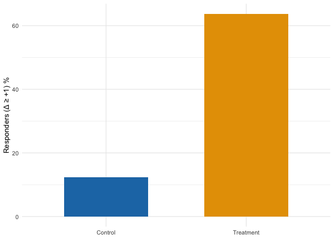

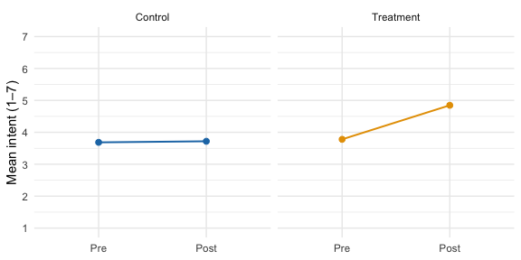

## Durability Analysis

We encountered an outcome‑page implementation failure in the first run
that prevented collection of immediate post‑intent. To recover the
primary outcome, we contacted those participants later via Prolific for
a short follow‑up survey that included the same 1–7 intention item. We
linked respondents deterministically by hashed Prolific IDs and computed
the delay between their original intervention completion and the
follow‑up response. This section estimates the arm effect using the
delayed post and examines whether the effect appears durable over the
observed follow‑up window. This analysis is exploratory only and the
participants in this sample are excluded from the confirmatory analysis.

We estimate the adjusted arm effect using the delayed post‑intent (N =
66). The estimate is 1.087 (95% CI 0.517, 1.658; p = 0.000).

| term      | estimate | std.error | conf.low | conf.high | p.value |
|:----------|---------:|----------:|---------:|----------:|--------:|
| arm_coded |    1.087 |     0.286 |    0.517 |     1.658 |       0 |

Rescue arm effect (HC3) with 95% CI

### Follow‑up Timing

|   N | mean_days | median_days | min_days | max_days |
|----:|----------:|------------:|---------:|---------:|
|  66 |       2.3 |         1.9 |      0.3 |      7.1 |

Follow‑up delay (days): N, mean, median, min, max

Histogram of days between intervention and rescue follow‑up

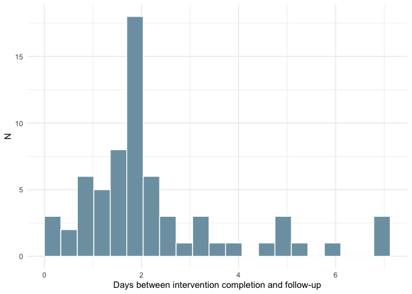

### Effect by Follow‑up Window

| bin      | estimate |    se | conf.low | conf.high | p.value |   n |
|:---------|---------:|------:|---------:|----------:|--------:|----:|
| ≤1.6d    |    1.006 | 0.692 |   -0.443 |     2.455 |   0.163 |  22 |
| 1.6–2.1d |    0.944 | 0.425 |    0.055 |     1.832 |   0.039 |  22 |
| \>2.1d   |    1.588 | 0.591 |    0.352 |     2.824 |   0.015 |  22 |

Arm effect by follow-up window (ANCOVA with HC3)

Adjusted arm effect by follow-up window using quantile-based bins;
points show estimates and bars show 95% CIs; dashed line at zero.

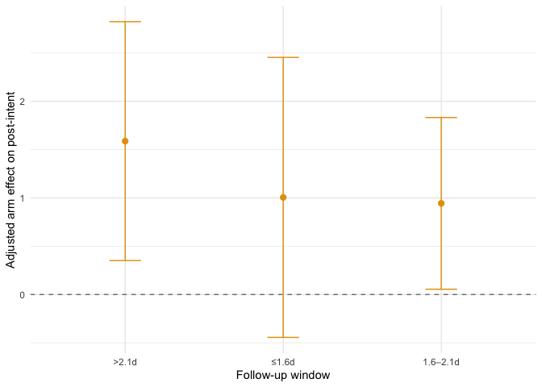

Taken together, the positive arm effect is evident within the most
common follow-up window (≤1.6d) at 1.01, and remains positive in the
next window (1.6–2.1d) at 0.94. This pattern indicates that the effect
persists over the observed follow-up period (up to 7.1 days), with wider
confidence intervals at longer delays due to smaller sample sizes.

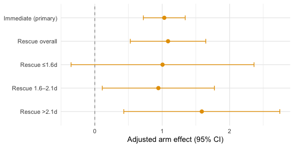

## Engagement in the Experimental Arm

We explore whether greater chat engagement within the Experimental arm
is associated with higher post-intent or change in intent (post minus
pre), adjusting for baseline intention. These are descriptive
associations and do not imply causality.

In the Experimental arm, chat engagement shows a negative but not
statistically significant association with post-intent: β = -0.0007 per
chat-point (95% CI -0.0026, 0.0012).

| term        | estimate | std.error | p.value |
|:------------|---------:|----------:|--------:|
| (Intercept) |   1.2427 |    0.5314 |      NA |
| pre_intent  |   0.9944 |    0.0868 |  0.0000 |
| chat_points |  -0.0007 |    0.0010 |  0.4845 |

Experimental arm: ANCOVA with chat_points (HC3)

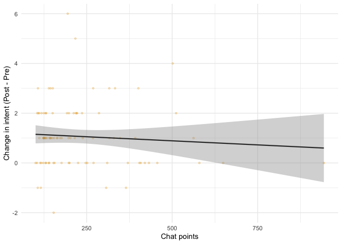

## Individual Trajectories

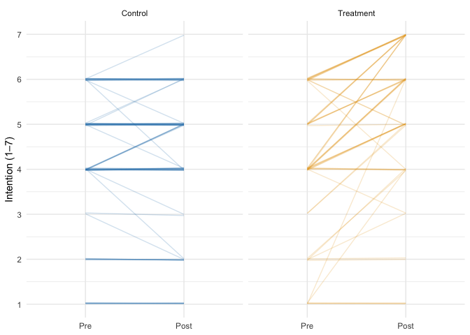

## Discussion

A combination of persuasive informational content and a focused
motivational-interviewing-style engagement with an LLM produced a clear
and significant increase in vaccination intention among MMR-hesitant
U.S. parents relative to a structure-matched active non-vaccine-related
child safety information control. The increase in intent appears to
persist over several days.

### Intent Increase

Among participants with baseline head‑room (pre ≤ 6), the Treatment arm
increased by **Δ ≈ 1.07 points**, while Control was essentially
unchanged (**Δ ≈ 0.03**). The ANCOVA arm effect (Treatment vs Control)
is **β̂ ≈ 1.03** with a 95% CI of **0.72–1.34**, excluding 0. Treatment
group parent intent increases from pre-to-post intervention by slightly
more than a full point on the seven‑point scale. **63.7%** of Treatment
participants increased their vaccination intention by at least one point
vs **12.4%** of Control participants.

### Durability

Using delayed post‑intent collected on Prolific, the adjusted arm effect
remains positive (**β̂ ≈ 1.09**) over several days. While exploratory and
subject to caveats, these results are suggestive of effect persistence.

### Prior Context

In a prior RCT ([analysis
write‑up](https://sjforman.me/mmr-persuasion-analysis.html),
[preregistration](https://osf.io/7upk5)), an LLM conversation about MMR
did not significantly outperform static CDC‑style materials (β̂ ≈ 0.14;
95% CI −0.11, 0.40), though both arms improved pre→post. Here, the
control group was not exposed to vaccine‑related content, so a larger
between‑arm contrast was both expected and observed. The absolute effect
is approximately double the effect size observed in either arm in RCT‑1.
Possible explanations include:

- an additive effect from combining static content with LLM dialogue
- more persuasive static content, including social norm statements and
  anticipated regret cues
- improved prompt engineering, including motivational interviewing style
- framing the intervention around an imagined appointment

Disentangling these mechanisms requires further research, but overall
the trials suggest that both static content and LLM conversation can
raise intention, and that combining them against a non‑MMR control
yields a substantial effect.

### Limitations

Outcomes are self‑reported intentions, evidence for durability is over a
short time window and with attrition, and the experiment was conducted
online in a U.S.-only sample.

### Implications

A brief, appointment‑framed MMR content review and conversation can
shift intention meaningfully relative to a non‑vaccine control, with
encouraging signs of durability over several days.

### Further research

Additional pre-clinical work could explore and disentangle the
mechanisms of action, and a clinical trial to assess whether an
intervention of this kind can impact real-world vaccination rates seems
clearly warranted.

Data & Code Availability

The Quarto source for this report and a self-contained HTML render will
be published on the investigator’s website and linked to from the OSF
project containing the preregistration. Participant‑level data include
potentially identifying Prolific IDs and cannot be shared publicly; they
will be provided upon reasonable request under a data‑use agreement.

Provenance

This document was rendered with R 4.5 and renv‑pinned packages. Batch
analysis files resolved at render time:

| batch | file |
|:---|:---|
| 2B | /Users/scott/Projects/verum-analysis/experiments/45ff14/data_freezes/experiment_analysis_view_exp-45ff14_20250910-153854.csv |
| 2B2 | /Users/scott/Projects/verum-analysis/experiments/5bb2fd/data_freezes/experiment_analysis_view_exp-5bb2fd_20250910-153904.csv |
| 2B3 | /Users/scott/Projects/verum-analysis/experiments/8bb589/data_freezes/experiment_analysis_view_exp-8bb589_20250910-095801.csv |

Main RCT‑2 analysis files resolved at render time

    Build: 2025-09-15 11:56 PDT; Git: a9bce03

